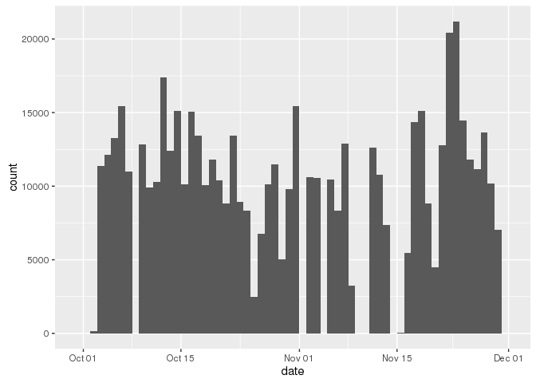
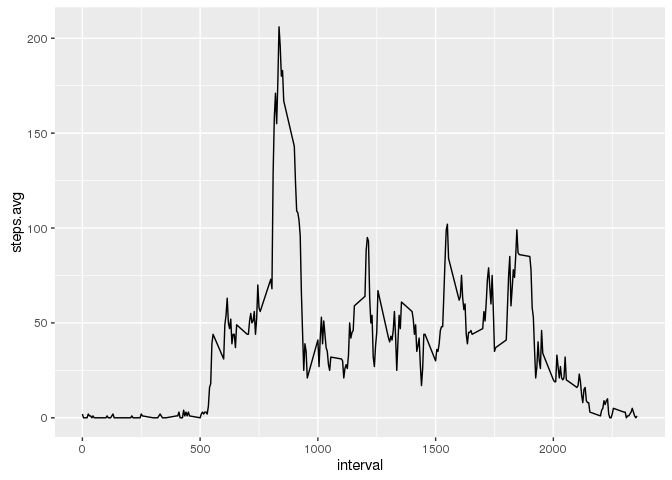
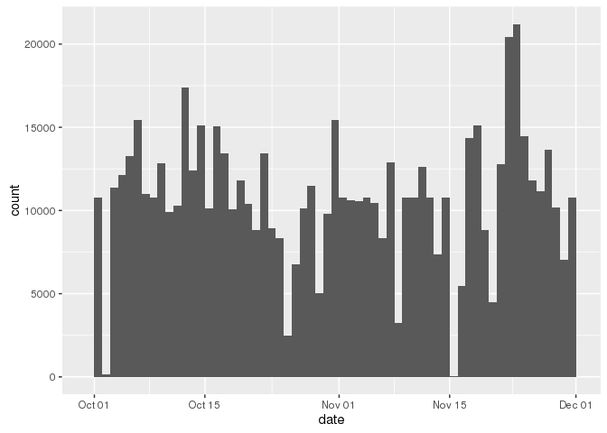
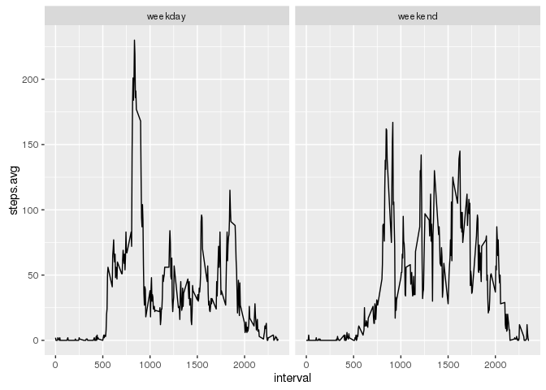

# Reproducible Research: Peer Assessment 1


## Loading libraries

```r
library(ggplot2)
library(dplyr)
```


## Loading and preprocessing the data

Extract data from zip file into a data folder if it doesn't exists.


```r
if(!file.exists("./data")) {
  dir.create("./data")
  unzip(zipfile = "./activity.zip", exdir = "./data")
}
```

Load activity data from extracted file.


```r
activity <- read.csv('./data/activity.csv', stringsAsFactors = FALSE)
```

Explicitly convert the date field.


```r
activity$date <- as.Date(activity$date, format = "%Y-%m-%d")
```


## What is mean total number of steps taken per day?


### Calculate total number of steps taken per day    


```r
activity.per.day <- activity %>% group_by(date) %>% summarize (steps = sum(steps))
```


### Show the total number of steps per day with an histogram


```r
qplot(date, data=activity.per.day, weight=steps, geom="histogram", binwidth=1)
```

\


### Mean and median of the total number of steps taken per day


```r
round(mean(activity.per.day$steps, na.rm = T))
```

```
## [1] 10766
```

```r
round(median(activity.per.day$steps, na.rm = T))
```

```
## [1] 10765
```

## What is the average daily activity pattern?

### Average of steps taken across all 5 minutes inverval

Calculate the average steps for each 5 minutes interval.


```r
activity.per.5mins <- activity %>% 
  group_by(interval) %>% 
  summarize (steps.avg = round(mean(steps, na.rm = T)))
```

Plot the result.


```r
qplot(x = interval, y = steps.avg, data = activity.per.5mins, geom = 'line')
```

\


### Which 5-minute interval, on average across all the days in the dataset, contains the maximum number of steps


```r
filter(activity.per.5mins, steps.avg == max(activity.per.5mins$steps.avg))
```

```
## Source: local data frame [1 x 2]
## 
##   interval steps.avg
##      (int)     (dbl)
## 1      835       206
```


## Imputing missing values

### Number of missing values


```r
count(filter(activity, is.na(steps)))
```

```
## Source: local data frame [1 x 1]
## 
##       n
##   (int)
## 1  2304
```


### Filling missing values


```r
activity.filled <- activity %>% 
  inner_join(activity.per.5mins, by="interval") %>%
  mutate(steps.filled = ifelse(is.na(steps), steps.avg, steps)) %>%
  transmute(date = date, interval = interval, steps = steps.filled)
```


### Calculate total number of steps taken per day    


```r
activity.per.day.filled <- activity.filled %>% group_by(date) %>% summarize (steps = sum(steps))
```


### Show the total number of steps per day with an histogram


```r
qplot(date, data=activity.per.day.filled, weight=steps, geom="histogram", binwidth=1)
```

\

Using imputation seems to change a little bit the graph, but not that much. Given the fact that missing values were replaced by the mean for the corresponding 5 minutes period, it doesn't change the mean at all... There's just a little bit less holes in the histogram.
 
### Mean and median of the total number of steps taken per day


```r
mean(activity.per.day.filled$steps, na.rm = T)
```

```
## [1] 10765.64
```

```r
median(activity.per.day.filled$steps, na.rm = T)
```

```
## [1] 10762
```


## Are there differences in activity patterns between weekdays and weekends?


```r
activity.filled$day.type <- 
  as.factor(ifelse(weekdays(activity.filled$date) %in% c("Saturday","Sunday"), 'weekend', 'weekday'))

activity.per.5mins <- activity.filled %>% 
  group_by(interval, day.type) %>% 
  summarize (steps.avg = round(mean(steps, na.rm = T)))

qplot(interval, steps.avg, data = activity.per.5mins, facets = . ~ day.type, geom='line')
```

\
